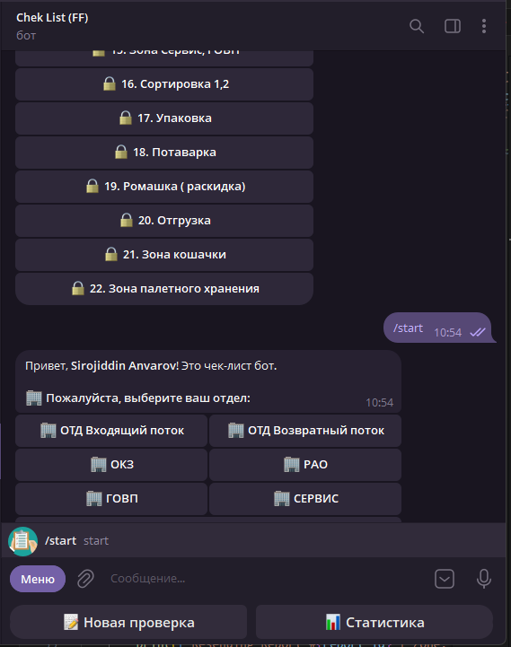
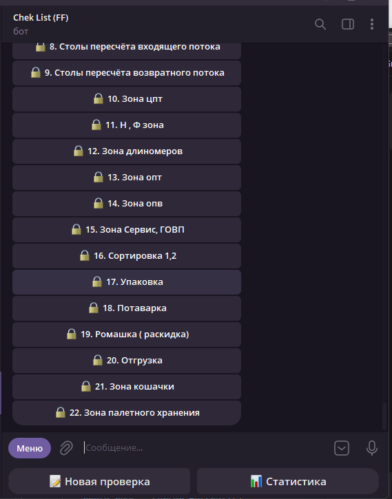
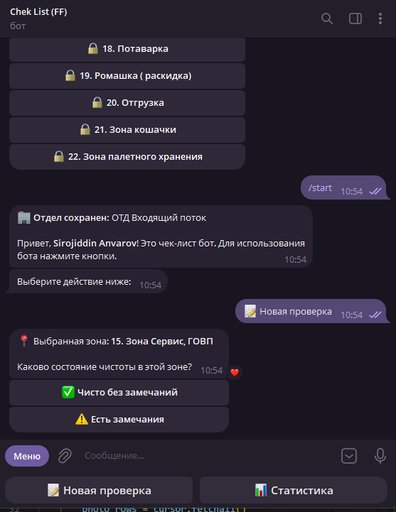
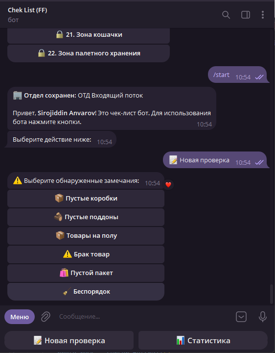
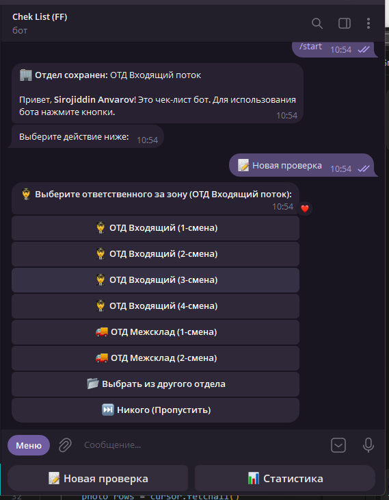
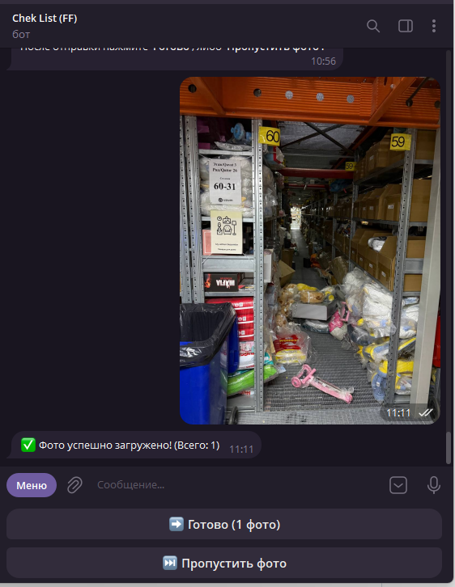
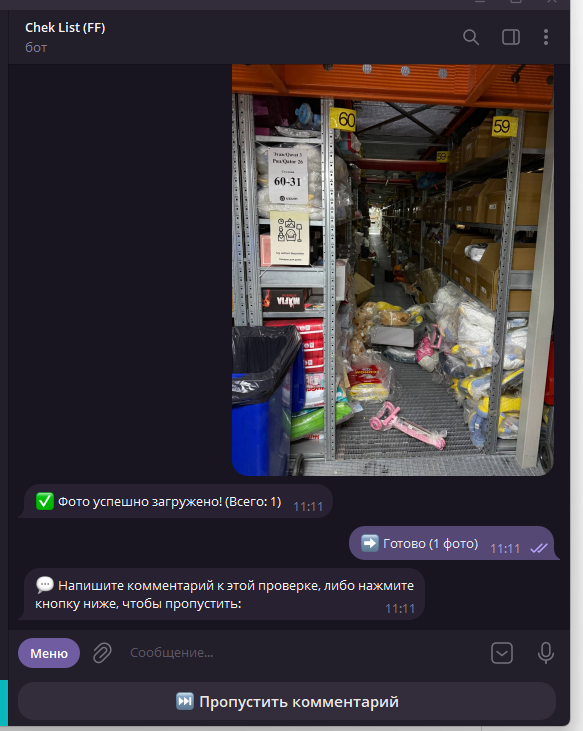
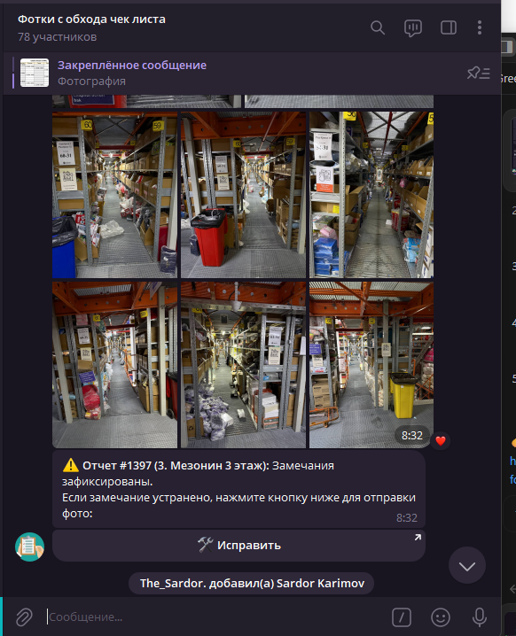

# 📦 Warehouse Fulfillment Checklist & Audit Telegram Bot (FF)

<div align="center">


**Профессиональный Telegram-бот для автоматизации контроля чистоты, аудита 22 зон склада, фотофиксации нарушений и мгновенной отправки отчётов с кнопкой «Исправить» в контрольную группу фулфилмента.**

[Особенности](#-ключевые-возможности) • [Пошаговый процесс в боте](#-пошаговый-процесс-в-боте-скриншоты) • [Структура зон](#-структура-складских-зон) • [Установка](#-установка-и-запуск) • [Архитектура](#-архитектура-проекта)

</div>

---

## 🌟 Ключевые возможности

- 📋 **Комплексный чек-лист по 22 складским зонам** (Мезонины 1–5 этажей, Ворота приемки 1–24, Столы пересчета, Зоны хранения, Сортировка, Упаковка, Отгрузка, Кошачка и др.).
- 🔍 **Детальная категоризация замечаний**:
  - 📦 Пустые коробки
  - 🪵 Пустые поддоны
  - 📦 Товары на полу
  - ⚠️ Брак товар
  - 🛍 Пустой пакет
  - 🧹 Беспорядок
- 👥 **Иерархическое распределение по отделам и сменам**:
  - `ОТД Входящий поток` (Смены 1–4, Межсклад 1–2 🚚)
  - `ОТД Возвратный поток` (Смены 1–4)
  - `ОКЗ`, `РАО`, `ГОВП`, `СЕРВИС`, `ЦПТ`
  - Поддержка ролей: **Старший смены**, **Ведущий специалист**, **Наставник**, **Вся смена**.
- 📸 **Мульти-фотофиксация нарушений** и комментариев.
- 📢 **Мгновенная отправка отчетов в группу Telegram**:
  - Автоматическая группировка фотографий (Media Group).
  - Указание проверяющего, зоны, категории замечания и тегирование ответственного за смену.
  - Интерактивная кнопка **🛠 Исправить** для закрытия замечания после уборки.
- 📊 **Глубокая аналитика и отчёты**:
  - Текстовая статистика за Сегодня / 3 дня / Все время с рейтингом ТОП-сотрудников.
  - Генерация подробных Excel-таблиц (`.xlsx`) со стилизацией, ссылками на фото и временем аудита.
- 🔄 **Отказоустойчивость**: Встроенный супервизор автоперезапуска (`run_bot.py`) с защитой от спящего режима Windows.

---

## 📱 Пошаговый процесс в боте (Скриншоты)

<div align="center">

### 1️⃣ Выбор отдела & 2️⃣ Выбор зоны склада
| 1. Авторизация и выбор отдела | 2. Выбор проверяемой зоны |
| :---: | :---: |
|  |  |

### 3️⃣ Статус чистоты & 4️⃣ Интерактивный чек-лист нарушений
| 3. Оценка состояния зоны | 4. Фиксация замечаний |
| :---: | :---: |
|  |  |

### 5️⃣ Назначение ответственного лица за смену & 6️⃣ Фотофиксация
| 5. Выбор ответственной смены / специалиста | 6. Загрузка фотографий нарушения |
| :---: | :---: |
|  |  |

### 7️⃣ Ввод комментария & 8️⃣ Мгновенный отчёт в группе с кнопкой «Исправить»
| 7. Добавление комментария к проверке | 8. Отчёт в группе склада (кнопка 🛠 Исправить) |
| :---: | :---: |
|  |  |

</div>

---

## 🗺 Структура складских зон (22 зоны)

1. 📍 **1. Мезонин 1 этаж**
2. 📍 **2. Мезонин 2 этаж**
3. 📍 **3. Мезонин 3 этаж**
4. 📍 **4. Мезонин 4 этаж**
5. 📍 **5. Мезонин 5 этаж**
6. 📍 **6. Ворота приёмки 1 - 8**
7. 📍 **7. Ворота приёмки 9 - 16**
8. 📍 **8. Ворота приёмки 17 - 24**
9. 📍 **9. Столы пересчёта возвратного потока**
10. 📍 **10. Столы пересчёта входящего потока**
11. 📍 **11. Зона КГТ**
12. 📍 **12. Зона хранения КГТ**
13. 📍 **13. Зона излишков**
14. 📍 **14. Зона обезлички**
15. 📍 **15. Зона брака**
16. 📍 **16. Зона прессовки**
17. 📍 **17. Зона высотного хранения 1**
18. 📍 **18. Зона высотного хранения 2**
19. 📍 **19. Зона высотного хранения 3**
20. 📍 **20. Зона высотного хранения 4**
21. 📍 **21. Зона кошачки**
22. 📍 **22. Зона палетного хранения**

---

## 🚀 Установка и запуск

### 1. Клонирование репозитория

```bash
git clone https://github.com/theanvarow/Chek-list-for-werehose-FF.git
cd Chek-list-for-werehose-FF
```

### 2. Создание виртуального окружения

```bash
# Windows
python -m venv venv
venv\Scripts\activate

# Linux / macOS
python3 -m venv venv
source venv/bin/activate
```

### 3. Установка зависимостей

```bash
pip install -r requirements.txt
```

### 4. Конфигурация `.env`

Создайте файл `.env` на основе шаблона:

```bash
cp .env.example .env
```

Заполните переменные:
```env
BOT_TOKEN=123456789:ABCdefGhIJKlmNoPQRsTUVwxyZ
DB_NAME=checklist_bot.db
PHOTOS_DIR=photos
GROUP_CHAT_ID=-100xxxxxxxxxx
```

### 5. Запуск бота

**Обычный запуск:**
```bash
python bot.py
```

**Запуск через супервизор (с автоматическим перезапуском при сбоях сети):**
```bash
python run_bot.py
```

---

## 🏗 Архитектура проекта

```plaintext
├── bot.py                  # Основной файл Telegram-бота (Aiogram 3, FSM, меню)
├── config.py               # Конфигурация отделов, смен, зон и токенов
├── database.py             # Слой работы с БД SQLite (сохранение отчетов, пользователи)
├── statistics.py           # Формирование текстовой статистики и Excel-выгрузок
├── run_bot.py              # Автономный супервизор для бесперебойной работы 24/7
├── test_checklist.py       # Комплексный скрипт тестирования всех модулей
├── requirements.txt        # Список зависимостей Python
├── docs/                   # Документация и скриншоты интерфейса
│   └── screenshots/        # Пошаговые скриншоты работы бота и группы
└── README.md               # Документация проекта
```

---

## 👨‍💻 Автор

- **Sirojiddin Anvarov** ([@theanvarow](https://github.com/theanvarow))

---

## 📄 Лицензия

Проект распространяется под лицензией [MIT](LICENSE).
